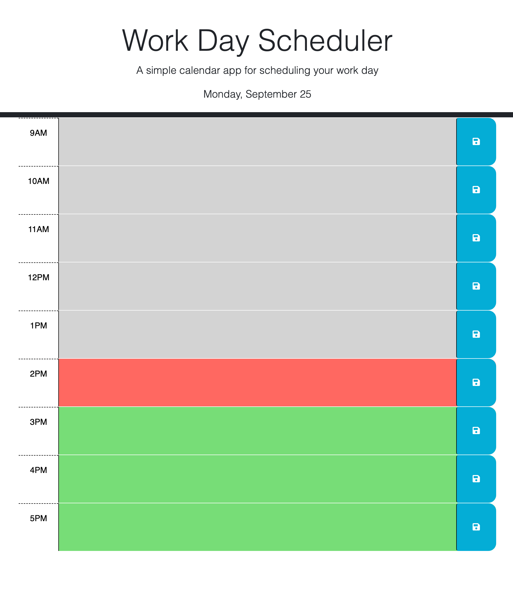

# Work Day Scheduler

## Description

This webpage acts as a calendar app for scheduling each individual hour of a typical work day, between the hours of 9AM and 5PM. The displayed hours are color-coded depending on what hour of the day it currently is for the user, and the header will automatically be updated to display the current date.

## Usage

Text can be entered into the space for each hour, which then can be saved to local storage by clicking on the save button to the right of the text area. When the user returns to the page later, the entered schedule will persist until it is changed or erased and saved by using the save button once again.

## Screenshot

## Link

[https://jaredbartos.github.io/work-day-scheduler](https://jaredbartos.github.io/work-day-scheduler)